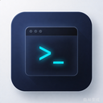

<p align="center">
  
</p>

<h1 align="center">NyaTerm — macOS 视觉分支</h1>

<p align="center">
  <strong>基于 <a href="https://github.com/nyakang/nyaterm">NyaTerm</a> 的界面定制分支，专注 macOS 风格的整体视觉重塑。</strong>
</p>

<p align="center">
  <a href="./README.md">English</a> · <a href="./README.zh-CN.md">简体中文</a>
</p>

---

## 关于本分支

本分支持续跟踪上游 [`nyakang/nyaterm`](https://github.com/nyakang/nyaterm) 并定期合并其更新。上游的全部功能——SSH、本地终端、Telnet、串口、RDP、VNC、SFTP、隧道、OTP、AI 助手、加密同步——在本分支中与上游完全一致。

本分支改动的是**外观与交互**：一套完整的 macOS 风格默认外观重塑、工作区界面重设计，以及全新的应用图标。完整功能列表请参见[上游 README](https://github.com/nyakang/nyaterm#readme)。

---

## 与原版的差异

### macOS 视觉重塑（默认外观）

- **macOS 中性灰默认主题**（深色 + 浅色），替换原 GitHub 配色默认值，强调色采用 macOS 系统蓝 `#0a84ff`
- **Mac 柔和终端调色板** —— 深浅两套低饱和 16 色 ANSI 终端配色
- **更大、更连贯的圆角** —— 10px 基准标尺（容器 14px、卡片 10px、输入框 8px、小元素 6px）
- **柔和分层阴影** —— 低不透明度、大扩散的柔和阴影，替换原先较硬的高程阴影
- **SF Pro 优先排版** —— 系统字体栈以 SF Pro 领衔，Windows 回退 Inter
- **更克制的动效** —— 150ms 浮动动画，弹窗/浮层/菜单采用更柔和的缩放与缓动；设置中提供界面动画开关

### 界面重设计

- **Safari 风格浮动胶囊标签页**
- **Edge 风格聚合菜单**，替换经典菜单栏
- **亚克力菜单表面** —— 半透明磨砂的菜单与浮层
- **胶囊输入框**
- **Finder 风格选中态**的已保存连接列表
- **macOS 风格活动栏与面板标题栏**，菜单蓝色高亮
- **沉浸式头部栏**，内嵌浮动面板卡片与更紧凑的面板间距
- **悬停才显示的分隔线**；圆角、透明的子窗口
- **Windows 打磨** —— 移除透明窗口的 DWM 非客户区边框，实现干净的无边框观感

### 品牌

- **全新终端应用图标** —— 覆盖 OS 打包图标（Windows/macOS/Linux/Android）与应用内 logo

### 构建 / CI

- 主干快照构建改为手动触发（`workflow_dispatch`），快照 release 标签通过 REST API 更新
- 使用本分支自己的 Tauri 更新签名密钥对
- 移除 Windows 7 构建目标


---

## 下载

Windows、macOS、Linux 的快照与正式构建发布在本分支的 [Releases](https://github.com/houxianghui/nyaterm/releases) 页面。

---

## 开发

```bash
git clone https://github.com/houxianghui/nyaterm.git
cd nyaterm
pnpm install
pnpm tauri dev
```

环境要求：Node.js 18+、pnpm、通过 [rustup](https://rustup.rs/) 安装的 Rust stable。

---

## 致谢

- [NyaTerm](https://github.com/nyakang/nyaterm) —— 本分支所基于的上游项目，全部核心功能均为上游的工作成果
- [WindTerm](https://github.com/kingToolbox/WindTerm)、[tabby](https://github.com/Eugeny/tabby)、[xterm.js](https://xtermjs.org/)、[russh](https://github.com/warp-tech/russh) —— 上游的灵感来源与技术基石

---

<a name="license"></a>
# 许可证

本项目基于 [MIT 许可证](LICENSE) 开源。
